# Setting up Sunday Slides Overview
- Matthew will send his notes by Thursday morning, but there could be changes.  Final notes by noon on Sunday.
  - We work from his outline, not the notes in the e-mail.  Look for the highlighted items in his outline.  
    - If there are talking points between verses, that’s an indication the verses will be on separate slides.
- We download the worship slides from [Lifepoint's FTP server](https://gofile.me/6WE6j/VxLTcyStx)
  - We can either do this on our local machine and upload them to the mac mini (what I do) or we can download directly from the mac mini (benefit of only one transfer delay)
- We import the worship slides and add them to our new playlist
- We set up the sermon slides

## Creating the playlist
- Duplicate the list called "Duplicate this List!" by Right-Clicking on the list and selecting duplicate.
  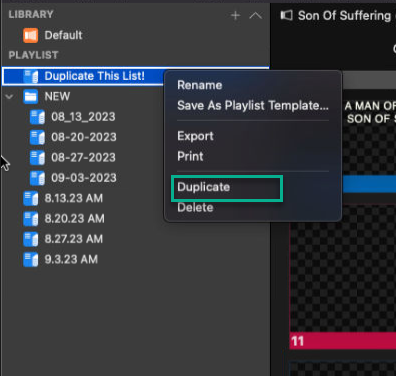
- Drag the Playlist to the desired Series folder, then right-click and rename it, based on the date of service.
  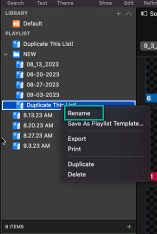

## Downloading the worship slides
### As mentioned above, we can either download to our local machine and upload to the mac mini, or download directly to the mac mini
  - I've historically chosen to download to my machine then upload to the mac mini to minimize the number of places my google drive account is logged in.
  - Now that Lifepoint is putting everything on [Lifepoint's FTP server](https://gofile.me/6WE6j/VxLTcyStx), it might be just as fast to download there.
### Complete the download
  - Go to [Lifepoint's FTP server](https://gofile.me/6WE6j/VxLTcyStx).  There is no authentication that I'm aware of.
  - Double-click on "Series."
  - Double-click on the "Current Series."
  - Double-click on the "Date of Service" you need to download worship slides for.
  - Download the appropriate "PROPLAYLIST file"
  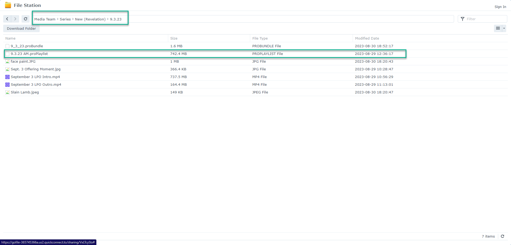
### Upload to Mac Mini if you downloaded to your local machine (Optional)
  - While connected in teamviewer to the Mac Mini, click on "Files and Extras"
    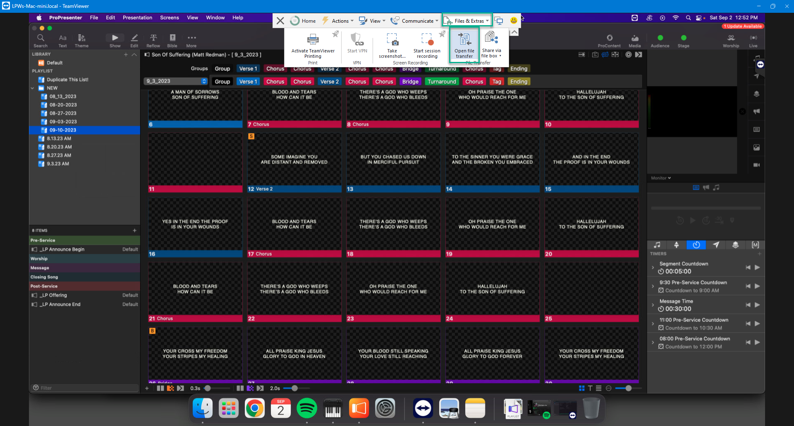
  - Click on "Open File Transfer"
    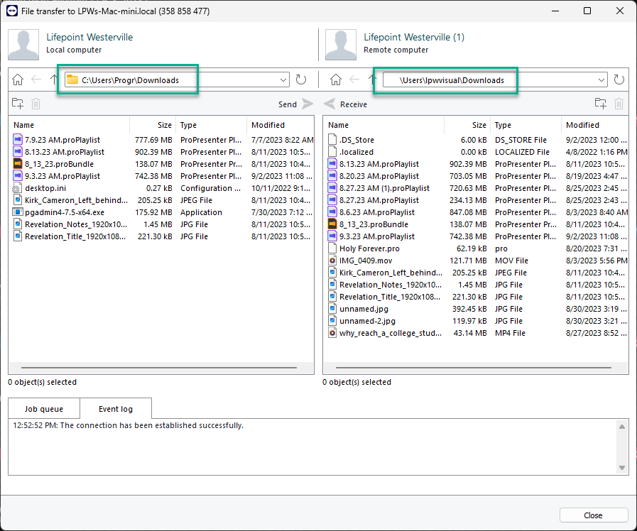
  - Navigate to whereever you downloaded the file on your local machine, and the downloads folder on the mac mini (see screenshot above)
  - Select the file you wish to transfer and then click "Send"
    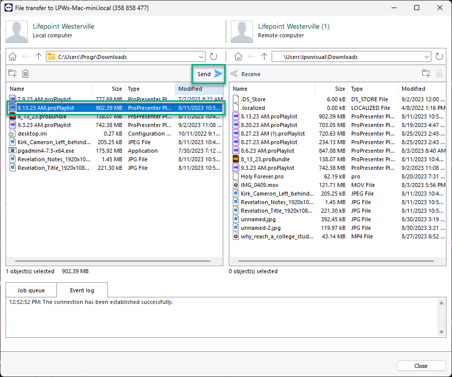
  - Once the transfer is complete, click "close."  
  ***NOTE*** You can continue to work on other things in the background while the transfer happens.

## Importing and setting up Worship Slides
  - Once you have gotten the worship slides file (PROPLAYLIST FILE) onto the Mac Mini, we're ready to import it into pro presenter, and add it to this week's playlist.
  - In ProPresenter, click on "File-> Import -> File"
    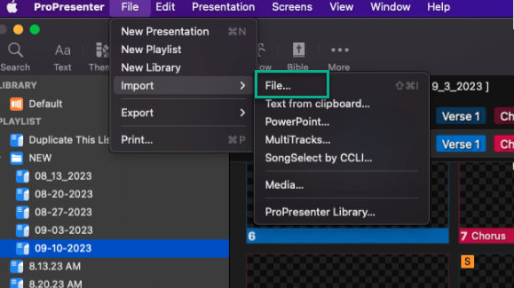
  - In the resulting dialogue box, navigate to the downloads folder and choose this week's PROPLAYLIST file.
    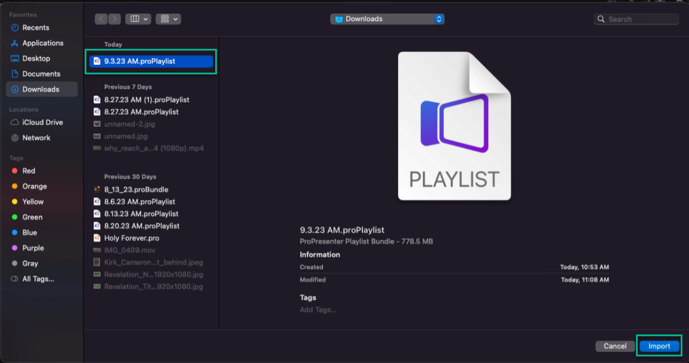
  - Because of the way we name our playlists, vs the way LC names the PROPLAYLIST file, we see something like the below.  We name our playlist "MM-DD-YYYY" and they theirs "M.DD.YYYY AM" generally.
    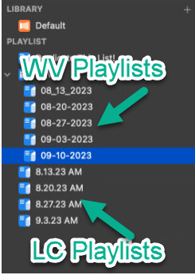
  - Select the LC Playlist we just imported so we can add the worship set to our playlist.
  - It's probably easiest to "add" everything and then remove what we don't want, so click on the first item, hold down the shift key, then click on the last time.
    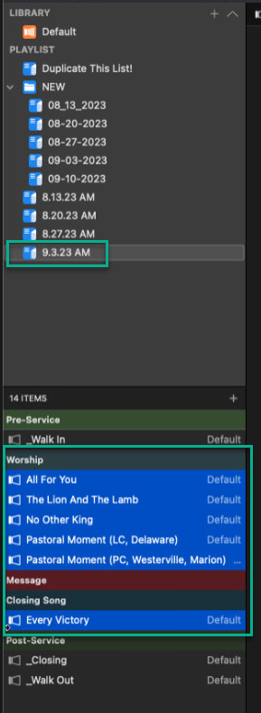
  - Right-Click on the list of selected items, then click "Add to" then the Playlist we created for this week.
    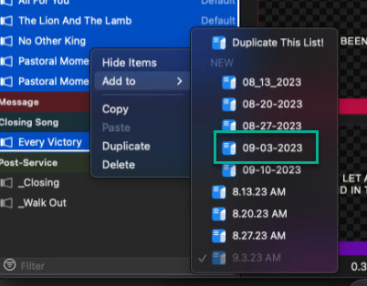
  - We are now technically done with the "LC" playlist and could remove it from our view if we wanted by right-clicking and clicking "delete."
  - Left-Click on the playlist for the week we're setting up.
  - Compare the order in the playlist to the order in Planning Center online.
    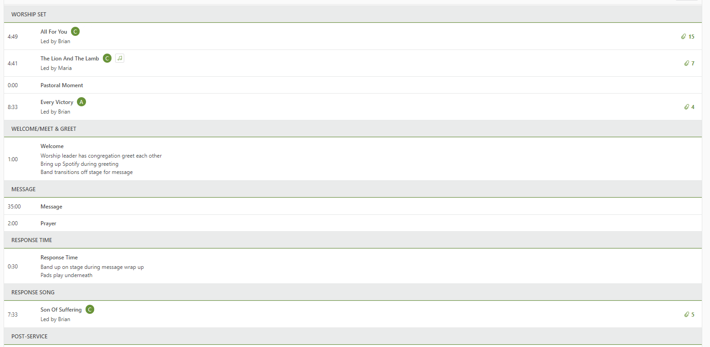
  - On rare occasions, we'll have a different worship set at Westerville than Lewis Center.  This week was one such week.  In comparing the screenshots below, you'll see we're doing "All for you", "The Lion And the Lamb", the "Pastoral Moment", then "Every Victory" for opening worship, and the closing song is "Son of Suffering."  See [Adding Songs from the Library](../adding-songs-from-the-library/adding_songs_from_the_library.md) for more info.
  - Once I have the worship songs in, I generally text Caleb at (763) 237-4244 and tell him what position in the playlist the worship songs are in.  MOST of the time, it's 4, 5, 6, and 11.  Note, in the screenshot, the headers for each portion of service also count as a position.
    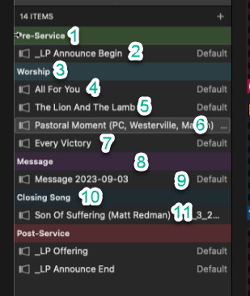
  - Now, we have to make sure things are set up for "Westerville" instead of "Lewis Center."
    - For each song, we need to make sure the "Worship Look" Macro is properly selected.  For some, it is, for others it isn't.
      - Right-click on the background slide and look at "remove actions."  If it says "Worship Look" and doesn't have an ugly yellow yield sign with an !, it's good.
        - Good
        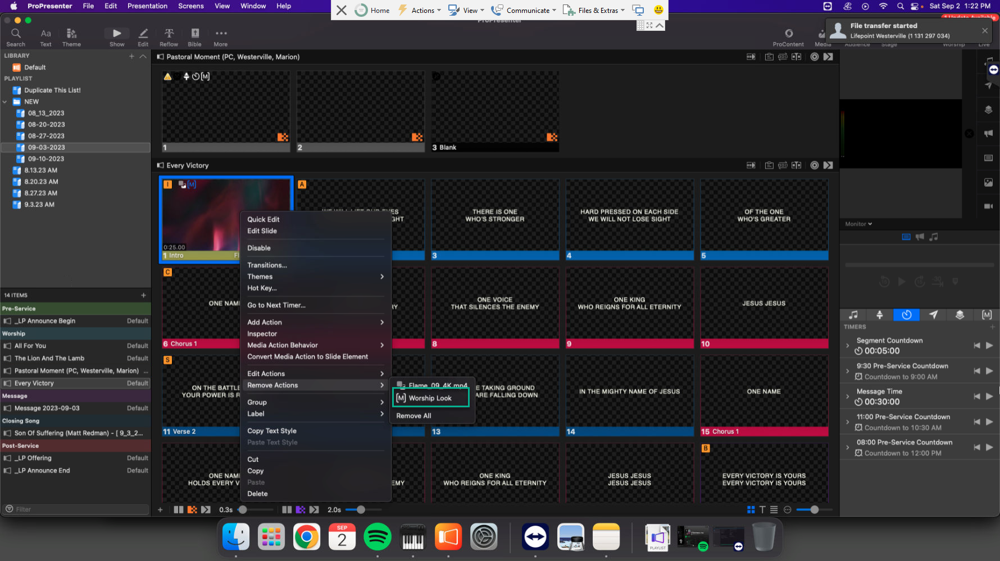
        - Bad
        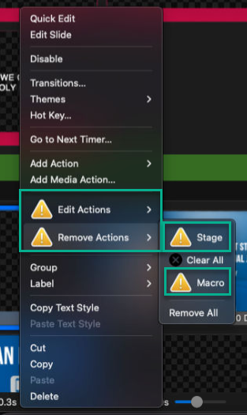
    - ***NOTE*** It's ***most*** important to have the macro on the first song of the worship set and the closing song, but it's good practice to put them on all.  The macro changes from the countdown timer on the confidence monitor to lyrics on the confidence monitor.
    - For each song, we need to make sure we've applied the Westerville Theme.  The Macro is supposed to make sure the theme is good, but it doesn't always catch everything, so we err on the side of caution.
      - ***NOTE*** If you're doing this remotely on your computer, the "Open-Apple" command is the "Windows button."
      - Select the first slide (background) of the song, and hit "Open-Apple + A" to "select all."  You can also use use "Edit -> Select All" from the menu.
        - Once all the slides for that song are selected, Right-Click -> Themes -> WV Lyrics -> Theme Slide
          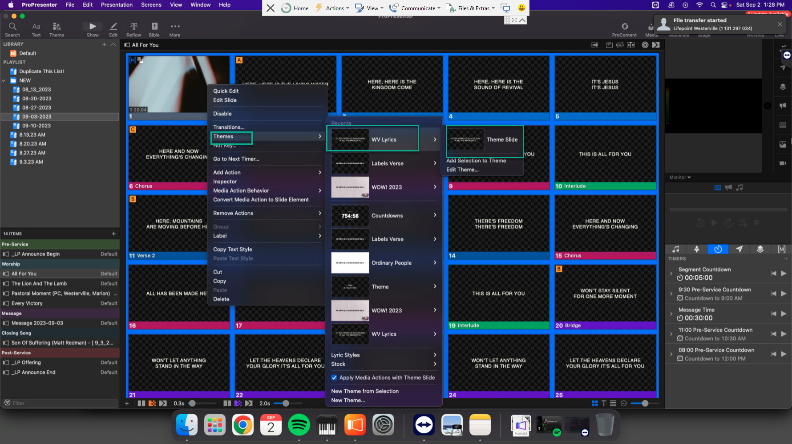
      - Repeat for each song in the worship set this week.

