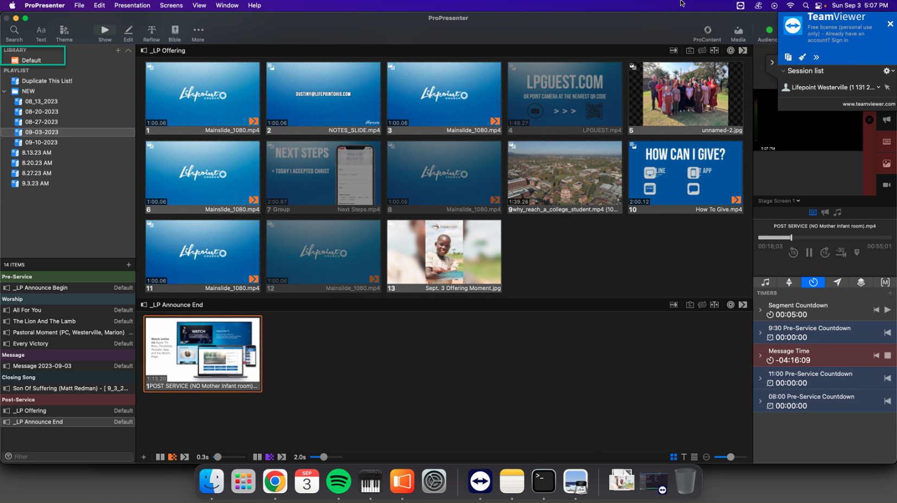
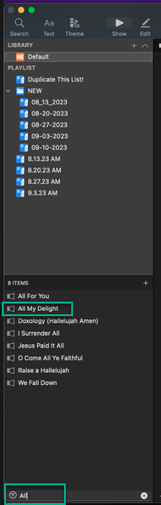
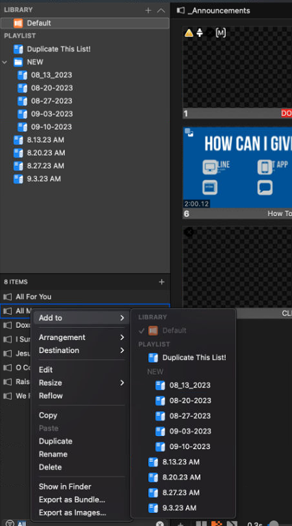

## Adding songs from the Library

- This doc assumes we've done the song you want to add to the playlist ast Westerville before.  Our library is currently based on songs we've received from Lewis Center as part of a weekly playlist.  Assuming we have the song in our library, adding it to a playlist is easy.
- Click on the "Default" Library

  
- Use the "Filter" option to search for the song you're looking for.  In this case, I filtered on "all" so I could find "All my Delight." 
  
  

- Right-Click on the song you want to add, select "Add To" and choose the playlist you'd like to add the song to.  

  