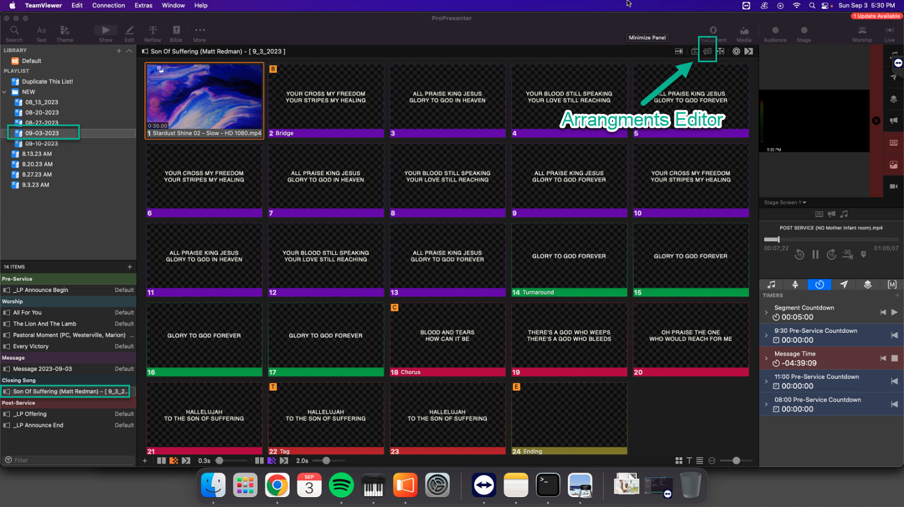
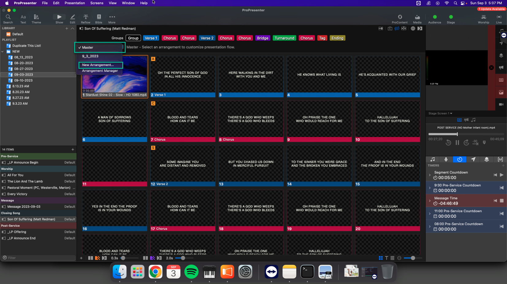
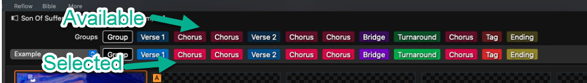
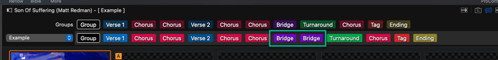
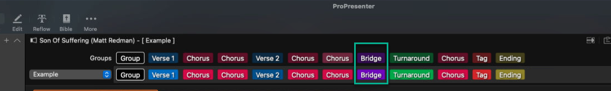
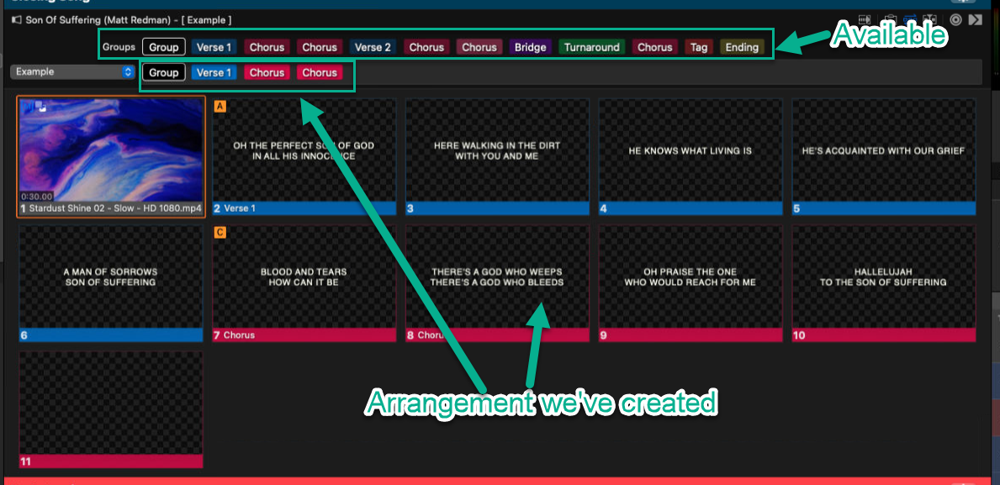

## Arrangements
- Arrangements are useful when we want to repeat the bridge, or a verse.  They're also useful when we want to cut bridges or verses.  

## Adding/Repeating a portion of a song
- Select the item you'd like to create an arrangment for, and open the arrangement editor.

  
- Create a new Arrangement
  
  
  - A window will pop up asking for a name.  Give the arrangement a meaningful name and click "OK"
- In this example, we want to add an additional bridge.
  - The top portion of the arrangement editor shows what's available, the bottom shows what's selected.
  
  - To add the bridge, simply drag and drop "Bridge" from "available" to "selected."  Once added, the arrangement now looks like this:
  

## Removing a portion of a song
- Select the item you'd like to create an arrangment for, and open the arrangement editor.

  
- Create a new Arrangement
  
  
  - A window will pop up asking for a name.  Give the arrangement a meaningful name and click "OK"
- In this example, we want to drop the additional bridge we just added.
  - The top portion of the arrangement editor shows what's available, the bottom shows what's selected.
  
- To remove the bridge, simply hover over one of the bridges and click the X that appears.
  

## Example of a new arrangement
- So what is the effect of adding or deleting items from the arrangement editor?  
- Select the item you'd like to create an arrangment for, and open the arrangement editor.

  
- Create a new Arrangement
  
  
  - A window will pop up asking for a name.  Give the arrangement a meaningful name and click "OK"
- For this example, we're going to drop this song down to only the first verse and a chorus
  
  
- To reverse this, we can drag any parts of the song back in that we need or want.
